# Изучение глобального изменения уровня CpG метилирования ДНК
Зиёев Рустам группа 3

Ссылка на колаб: https://colab.research.google.com/drive/1xKL11kpa4LnamuwMWWmMGn8AVSE-0OE-?usp=sharing

### Итоговые показатели

BS-Seq | ch11: 11347700-11367700 | ch11: 40185800-40195800 | deduplication 
--- | --- | --- | ---
SRR5836473 | 1090 | 464 | 81.69
SRR3824222 | 2328 | 1062 | 97.08
SRR5836475 | 1456 | 630 | 90.92

### Per base sequence content
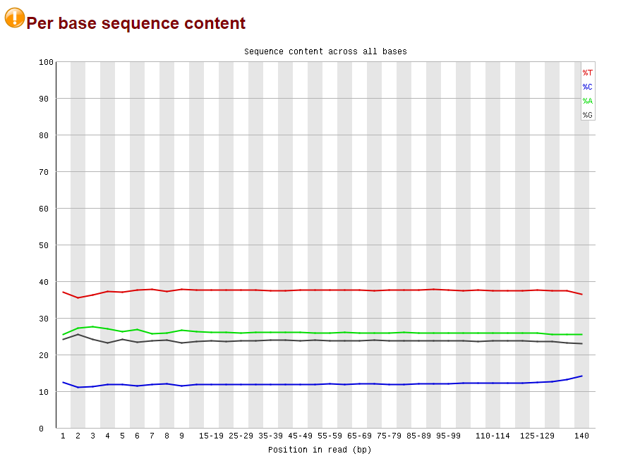
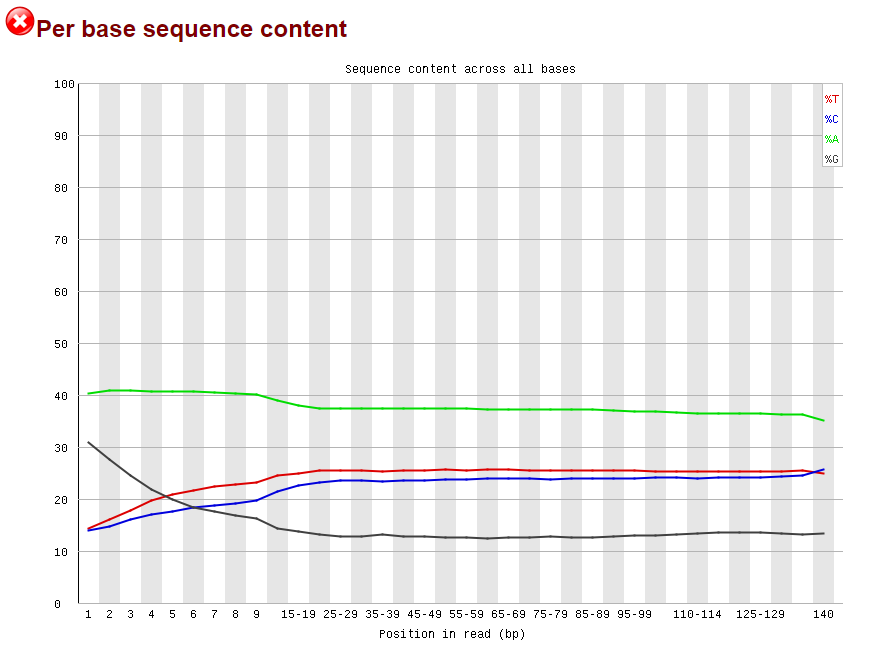
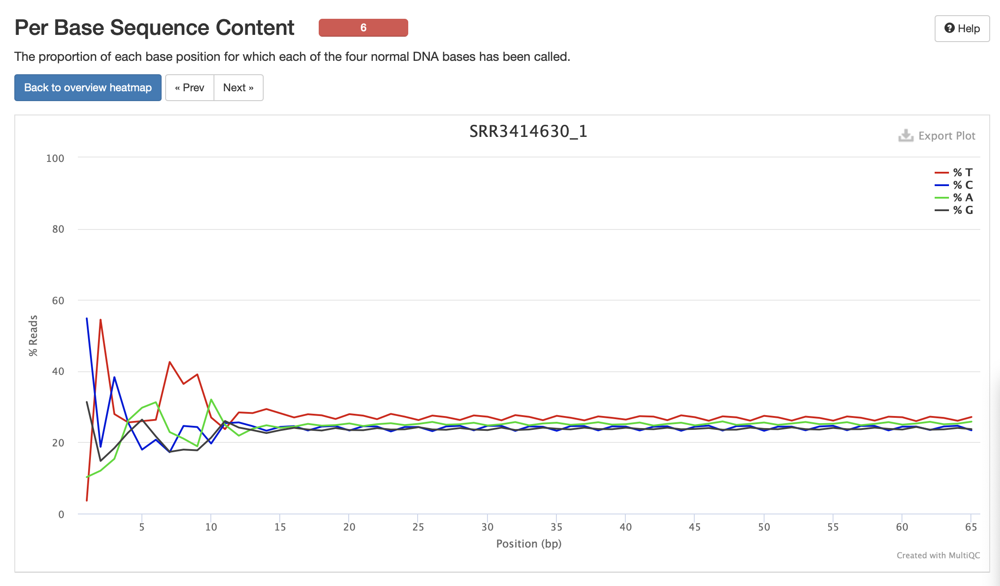

## Per sequence GC content
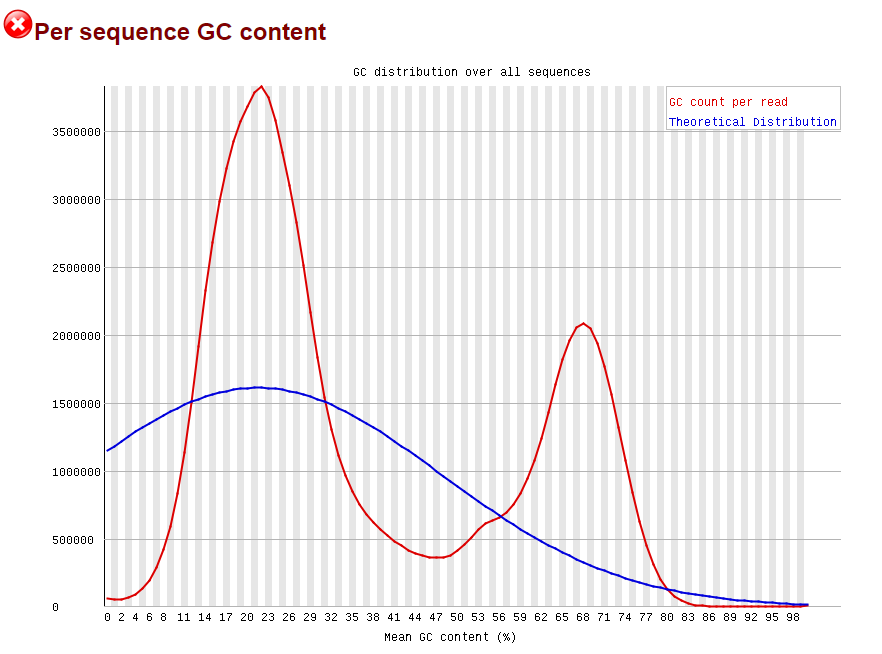
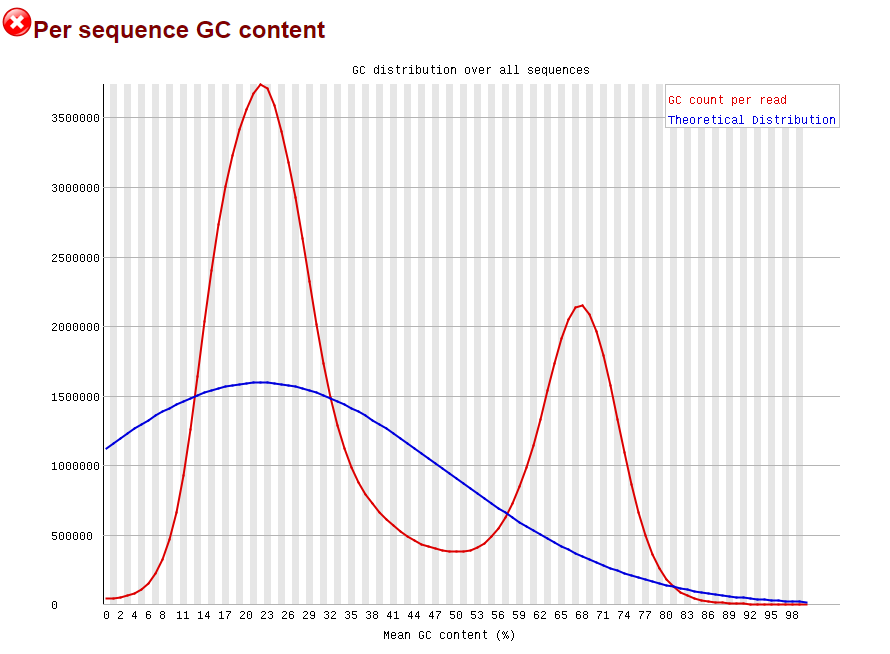
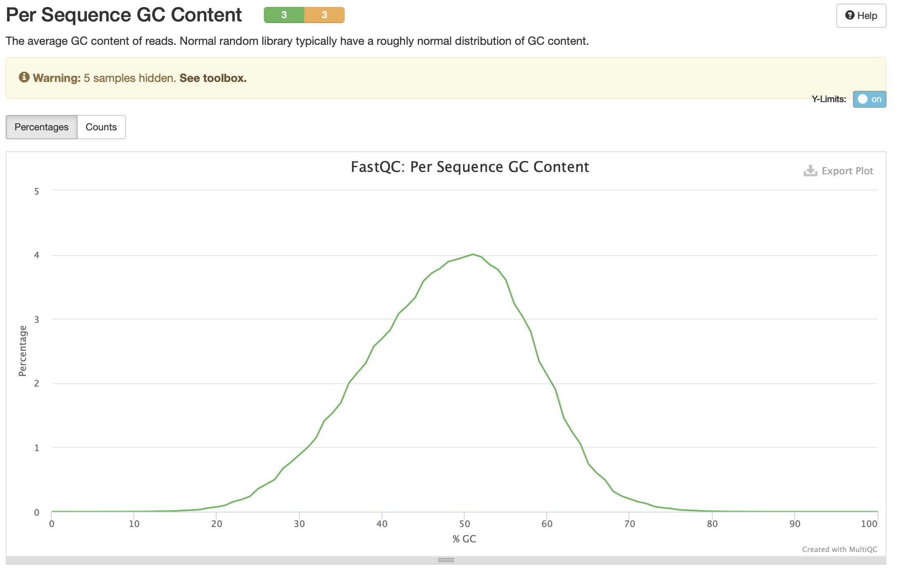

### SRR3824222
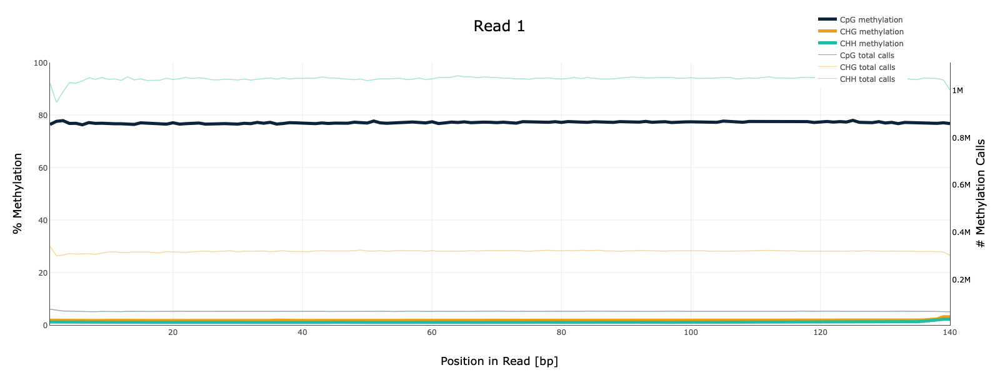
 

### SRR5836473

 

### SRR5836475

 

## Гистограмы распределения метелирования цитозинов по хромосоме
### SRR3824222 - Epiblast
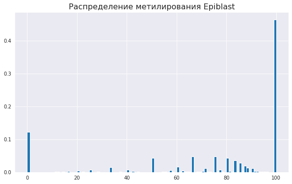
### SRR5836475 - ICM
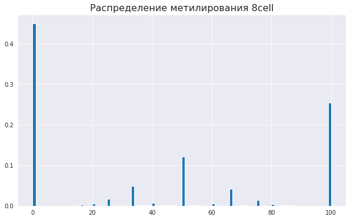
### SRR5836473 - 8 Cell
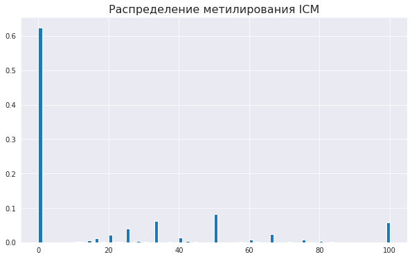

### Уровень метилирования

### Уровень покрытия
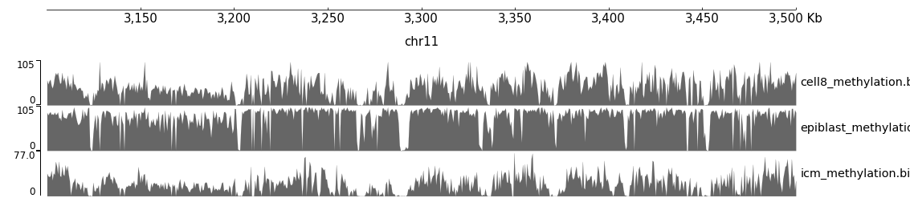

